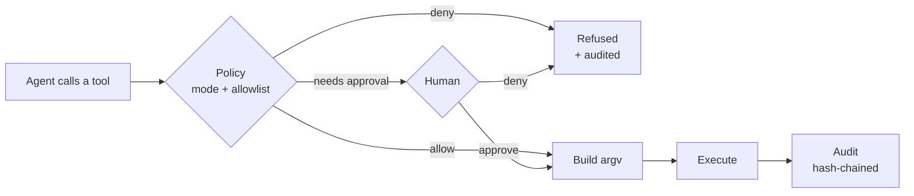

<div align="center">

# opsgate

**The safety gate between AI agents and your servers.**

An MCP server that lets Claude, Cursor, or any AI agent operate real infrastructure —
without handing it a root shell.

[](https://github.com/polymatx/opsgate/actions/workflows/ci.yml)
[](https://goreportcard.com/report/github.com/polymatx/opsgate)
[](https://pkg.go.dev/github.com/polymatx/opsgate)
[](LICENSE)
[](https://go.dev)
[](https://modelcontextprotocol.io)

[What it looks like](#what-it-looks-like) ·
[30-second try](#try-it-in-30-seconds-no-server-needed) ·
[Break it yourself](#break-it-yourself) ·
[Tools](#tools) ·
[Security model](#security-model) ·
[Contributing](#contributing)

</div>

---

## What it looks like

You ask a question. The agent investigates with read-only tools and answers.

> **You:** Something's listening on port 8000 on my server and I don't remember what. Check it.

```
▸ listening_ports(host: "hetzner")

  Netid State  Recv-Q Send-Q  Local Address:Port  Process
  tcp   LISTEN 0      511         0.0.0.0:443     users:(("nginx",pid=249619),…)
  tcp   LISTEN 0      511         0.0.0.0:80      users:(("nginx",pid=249619),…)
  tcp   LISTEN 0      4096        0.0.0.0:22      users:(("sshd",pid=237597),…)
  tcp   LISTEN 0      151       127.0.0.1:3306    users:(("mysqld",pid=237695),…)
  tcp   LISTEN 0      5         127.0.0.1:8000    users:(("python3",pid=237608),…)

▸ service_list(host: "hetzner", state: "running")

  docker.service       loaded active running  Docker Application Container Engine
  mysql.service        loaded active running  MySQL Community Server
  nginx.service        loaded active running  A high performance web server…
  php8.3-fpm.service   loaded active running  The PHP 8.3 FastCGI Process Manager
  pm2-root.service     loaded active running  PM2 process manager
```

> **Claude:** Port 8000 is a bare `python3` process (pid 237608) bound to localhost only, so
> it isn't reachable from outside. It's not managed by systemd — no unit owns it — which
> means it won't survive a reboot. It's most likely something started by hand in a shell.

Now something that changes state. In `operate` mode the agent cannot just do it:

> **You:** OK, nginx config changed. Reload it.

```
▸ nginx_test(host: "hetzner")
  nginx: configuration file /etc/nginx/nginx.conf test is successful

▸ nginx_reload(host: "hetzner")

  ┌─ opsgate: approval required ─────────────────────────────────┐
  │ allow nginx_reload on host "hetzner"?                        │
  │                                                             │
  │ The nginx configuration passed validation.                  │
  │ This will reload nginx.                                     │
  │                                                             │
  │ Command: 'nginx' '-s' 'reload'                               │
  │                                        [ Approve ]  [ Deny ] │
  └─────────────────────────────────────────────────────────────┘
```

You click Deny, and nothing happens — the agent is told the operator refused. Approve, and
it runs and lands in the audit log. Either way you saw the exact command first.

*(Tool output above is real output from a live server; the prompt is rendered by your MCP
client, so it looks however that client draws it.)*

## Try it in 30 seconds (no server needed)

opsgate runs with **no config file at all** — local machine, read-only:

```bash
go install github.com/polymatx/opsgate/cmd/opsgate@latest
opsgate serve
```

```
opsgate dev | mode=observe | default_host=local | audit=~/.opsgate/audit.jsonl
```

That's it. No config, no SSH, and it defaults to `observe` — so it can read your disk usage
and journal, and it will refuse to change anything:

```
▸ disk_usage()          → works
▸ service_restart(...)  → Refused by opsgate policy: host is in observe mode
```

Point your client at it and ask "what's using disk space on this machine?" When you're
ready for real hosts, add a config with `opsgate init`.

### Which clients can reach it

opsgate runs **on your machine** (or on the server itself) and holds your SSH key, so the
transport you need depends on where your client actually executes:

| Client | Transport | Works because |
|---|---|---|
| Claude Code (terminal) | stdio | Runs natively on your machine and launches the binary |
| Claude Desktop, Cursor, VS Code | stdio | Same — a local process |
| Cloud or sandboxed surfaces (web chat, VM-backed agents) | **HTTP** | They cannot launch a local process, or even see your SSH key — they can only reach a URL |

If your client reports it has no access to your servers, it is almost certainly one of the
sandboxed kind. Serve over [HTTP](#any-client-over-http) instead of stdio.

Before publishing that endpoint, read the warning there: it puts an
infrastructure-management API on whatever network you expose it to.

### Wire it up to your client

<details>
<summary><b>Claude Code</b></summary>

```bash
claude mcp add opsgate -- opsgate serve --config ~/.opsgate/config.yaml
```
</details>

<details>
<summary><b>Claude Desktop / Cursor</b> (<code>claude_desktop_config.json</code> or <code>.cursor/mcp.json</code>)</summary>

```json
{
  "mcpServers": {
    "opsgate": {
      "command": "opsgate",
      "args": ["serve", "--config", "/absolute/path/to/opsgate.yaml"]
    }
  }
}
```
</details>

<details id="any-client-over-http">
<summary><b>Any client, over HTTP</b> (needed for cloud/sandboxed clients)</summary>

```yaml
http:
  addr: "127.0.0.1:8080"
  auth_token: "a-long-random-token"   # sent as: Authorization: Bearer <token>
```

```bash
opsgate serve --http 127.0.0.1:8080
```

The tidiest deployment is to run opsgate **on the server it manages** — then it needs no SSH
key at all (`default_host: local`) — behind a TLS-terminating reverse proxy:

```
client ──HTTPS──▶ nginx / Caddy ──▶ 127.0.0.1:8080  opsgate
                  + Bearer token
```

> [!WARNING]
> Exposing this endpoint puts an infrastructure-management API on that network, and the
> bearer token becomes the only thing protecting it. If you must publish it: keep
> `mode: observe`, generate 32+ bytes of randomness for the token, require TLS, and add an
> IP allowlist at the proxy. Binding it to a VPN interface (WireGuard, Tailscale) instead of
> the public internet is strictly safer — your own devices reach it, nobody else can.
>
> Note also that `operate` mode expects a human who can answer an approval prompt. An
> unattended HTTP deployment usually means `observe`.

</details>

## The problem this solves

Letting an AI agent run your servers today means giving it `exec("<any string>")` over SSH.
The usual mitigation is a denylist of commands that *look* dangerous.

That does not work. Denylists are guesswork against an adversary with infinite phrasings:

```
rm -rf /                              →  blocked
r''m -rf /                            →  not blocked
echo cm0gLXJmIC8K | base64 -d | sh    →  not blocked
```

And "dangerous-looking" isn't even the hard part. `systemctl restart nginx` is a perfectly
ordinary command that is catastrophic at 3pm on Black Friday.

## The approach

opsgate does not filter strings. **It never gives the agent a string to fill in.**

The agent gets 25 typed tools — `service_restart(name)`, `docker_logs(container)`,
`journal_tail(unit, since, priority)` — and opsgate builds the command itself as an `argv`
array. There is no shell to inject into, because no shell string is ever assembled from
agent input.

```go
// What opsgate does — the name is one argv element, whatever it contains
argv := []string{"systemctl", "restart", in.Name}

// What it never does
argv := []string{"sh", "-c", "systemctl restart " + in.Name}
```

Send `nginx; rm -rf /` as the service name and `systemctl` receives it as a single literal
argument and fails as an unknown unit. Nothing else runs.

Every call then passes through four gates:



| Layer | What it does |
|---|---|
| **Structured tools** | Commands are built as `argv`, never string-concatenated. Injection is impossible by construction, not by filtering. |
| **Deny-by-default policy** | Three modes — `observe` (read-only), `operate` (writes need approval), `full`. Per-host overrides, per-tool target allowlists. |
| **Human approval gates** | Mutating calls pause and ask you, showing the exact command. Needs a client that supports MCP elicitation; if it cannot ask, the call is refused rather than run. |
| **Tamper-evident audit** | Every call — including every refusal — appended to a hash-chained JSONL log. Editing or deleting any line is detectable. |

The default mode is `observe`. Out of the box, an agent can diagnose your servers and
change nothing.

## Break it yourself

Don't take the claims on faith. Start opsgate in `observe` mode with
`files.allow_paths: [/var/log]` and try these — every one is refused, and the refusal is
logged:

| Try this | What happens |
|---|---|
| `service_status(name: "nginx; touch /tmp/pwned")` | Refused — invalid characters in a target name |
| `file_read(path: "/var/log/../../etc/shadow")` | Refused — outside the allowed paths |
| `file_read(path: "/root/.ssh/id_rsa")` | Refused — outside the allowed paths |
| `file_grep(pattern: "x$(touch /tmp/pwned)")` | Searched as a *literal string*; nothing executes |
| `service_restart(name: "nginx")` | Refused — observe mode cannot mutate |
| `journal_tail()` with `allow_targets` set | Refused — omitting the unit would read the whole journal |
| `shell_exec(command: "id")` | Refused — the tool isn't even registered unless you opt in |

Then confirm nothing landed:

```bash
$ ls /tmp/pwned
ls: cannot access '/tmp/pwned': No such file or directory

$ opsgate audit verify
audit chain OK: 6 records verified in ~/.opsgate/audit.jsonl
```

(Six, not seven: `shell_exec` isn't a registered tool at all when it's disabled, so that
call is rejected by the protocol before it reaches a gate.)

Found something that *does* get through? That's a security bug — please
[report it](SECURITY.md).

## Modes

```yaml
mode: observe   # read-only. Mutating tools are refused outright.
mode: operate   # reads run freely; every write asks you first.  ← recommended
mode: full      # writes run unprompted. Still fully audited.
```

Pin production tighter than everything else:

```yaml
mode: operate
hosts:
  prod:
    addr: 10.0.0.1
    mode: observe        # prod is read-only even though the default is operate
  staging:
    addr: 10.0.0.2       # inherits operate
```

Restrict *what* a tool may touch:

```yaml
tools:
  service_restart:
    allow_targets: ["nginx", "myapp*"]   # postgresql is not restartable, period
  service_stop:
    enabled: false                       # remove the tool entirely
  shell_exec:
    enabled: true                        # opt in to freeform shell (still approval-gated)
```

Setting `allow_targets` also makes the target **mandatory** for that tool: omitting it is
usually broader than any allowed value — `journal_tail` with no unit reads the whole
journal — so an unconstrained call is refused rather than silently permitted.

See [configs/opsgate.example.yaml](configs/opsgate.example.yaml) for every option.

## Tools

**Observe** — always available

`system_info` · `disk_usage` · `process_top` · `listening_ports` · `service_list` ·
`service_status` · `docker_ps` · `docker_logs` · `docker_inspect` · `docker_stats` ·
`compose_ps` · `journal_tail` · `journal_errors` · `file_read` · `dir_list` ·
`file_grep` · `nginx_test`

**Mutate** — refused in `observe`, approval-gated in `operate`

`service_restart` · `service_start` · `service_stop` · `service_reload` ·
`docker_restart` · `docker_start` · `docker_stop` · `nginx_reload`

**Opt-in**

`shell_exec` — freeform shell. Disabled unless you enable it; always approval-gated. It
exists for the genuine long tail, and everything above exists so you rarely need it.

`nginx_reload` runs `nginx -t` first and refuses to reload a config that does not parse.

### Things worth asking your agent

- *"Why is nginx throwing 502s on web1?"* — correlates `service_status`, `journal_tail`, `docker_ps`
- *"What filled up the disk on prod?"* — `disk_usage` then `dir_list` under allowed paths
- *"Did anything crash overnight?"* — `journal_errors` across hosts
- *"Which containers are unhealthy and how many times have they restarted?"* — `docker_inspect`
- *"Compare staging and prod: what's running on one but not the other?"* — `service_list` on both

## The audit log

Every call appends one JSON line embedding the hash of the previous record:

```jsonl
{"seq":41,"time":"2026-07-29T11:02:14Z","host":"web1","tool":"service_status","decision":"allow","exit_code":0,…,"prev_hash":"9f2c…","hash":"41ab…"}
{"seq":42,"time":"2026-07-29T11:02:31Z","host":"web1","tool":"file_read","args":{"path":"/root/.ssh/id_rsa"},"decision":"deny","error":"outside the allowed paths",…}
{"seq":43,"time":"2026-07-29T11:03:02Z","host":"web1","tool":"service_restart","phase":"intent","decision":"needs_approval","approved":true,…}
{"seq":44,"time":"2026-07-29T11:03:02Z","host":"web1","tool":"service_restart","phase":"outcome","decision":"needs_approval","approved":true,"exit_code":0,…}
```

Refusals are recorded too — a blocked attempt to read a private key is exactly what you
want to find later.

A state-changing call writes two records: `phase: intent` **before** the command runs and
`phase: outcome` after. If the intent record cannot be written, opsgate refuses to act — so
an action that happened can never be missing from the log.

```bash
$ opsgate audit verify
audit chain OK: 143 records verified in ~/.opsgate/audit.jsonl
```

Edit, delete, or reorder any line and verification fails at exactly that point:

```bash
$ opsgate audit verify
opsgate: audit chain INVALID after 41 records: line 42: record tampered (hash mismatch)
```

Splicing in a forged field doesn't work either — verification decodes strictly:

```bash
opsgate: audit chain INVALID after 2 records: line 3: json: unknown field "approved_by"
```

Values under keys like `password` and `token` are redacted before they are written, and only
the SHA-256 of command output is stored — never the output itself.

## How this compares

Other SSH-over-MCP servers exist and are useful; they make a different trade.

| | Freeform-shell MCP servers | opsgate |
|---|---|---|
| What the agent sends | a command string | typed arguments to a fixed tool |
| Injection defense | regex denylists on the string | no shell string is built — argv only |
| Approval | none, or client-side auto-approve | per-call, server-side, shows the exact command |
| Read-only guarantee | convention | `observe` mode has no code path to mutation |
| Audit | varies | hash-chained, includes refusals, intent-before-execution |
| Runtime | usually Node | single static Go binary, no runtime |

The honest trade: opsgate's tool set is finite, so something you need may not be covered
yet. That's what `shell_exec` and [contributions](#contributing) are for.

## Security model

opsgate reduces blast radius. It is not a sandbox, and it does not make an untrusted agent
safe to point at production.

**What it guarantees**

- Agent input never becomes shell syntax. Commands are `argv`; the SSH transport
  single-quotes every element, so each argument stays one literal word.
- `observe` mode cannot mutate. There is no code path from a read-only mode to a
  state-changing command.
- File tools cannot escape `files.allow_paths` — paths are cleaned before the prefix check,
  so `/var/log/../../etc/shadow` is refused.
- SSH host keys are verified against `known_hosts`. Unknown keys are refused, never trusted
  on first use.
- Every decision is audited, including refusals, and a mutating action is recorded before
  it runs.

**What it does not**

- Tools run with the privileges of your SSH user. If that is root, an approved call is a
  root call. Give opsgate its own least-privilege user.
- `shell_exec`, once enabled and approved, is arbitrary code execution. That is its purpose.
- `full` mode removes the human. Use it only where you accept that.
- A prompt-injected agent can still call *allowed* tools with plausible arguments. The
  policy is what bounds the damage — keep `allow_targets` tight.
- The path check is lexical: a symlink inside an allowed directory pointing outside it will
  be followed.

See [docs/threat-model.md](docs/threat-model.md) for adversaries, controls, and limits in
detail.

## Why this exists

I run my own infrastructure and I wanted to point Claude at it. Every existing option asked
me to choose between "useless" and "here is a root shell, good luck." opsgate is the middle:
the agent gets real capability, I keep the veto and the receipts.

## Contributing

Contributions are genuinely welcome, and the architecture makes new tools easy — most are
~20 lines. Read [CONTRIBUTING.md](CONTRIBUTING.md) for the one rule that matters (commands
are argv, never concatenated strings).

**Good first contributions**

- **More structured tools** — Kubernetes (`kubectl get/describe/logs`), PostgreSQL and MySQL
  status, Caddy, Traefik, `ufw`/`iptables` status, certificate expiry, `apt`/`dnf` pending
  updates
- **Policy primitives** — time windows ("no restarts during business hours"), rate limits,
  per-tool concurrency caps
- **Audit sinks** — syslog, append-only S3, webhook
- **Client compatibility reports** — tell us how the approval prompt renders in your MCP
  client

```bash
go test -race ./...
go vet ./...
gofmt -l .          # must print nothing
```

If opsgate is useful to you, a ⭐ helps other people running their own infrastructure find
it.

## License

MIT — see [LICENSE](LICENSE).
